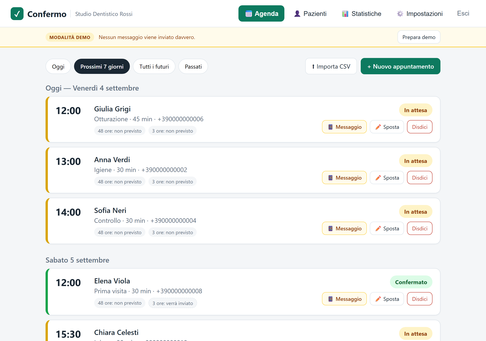
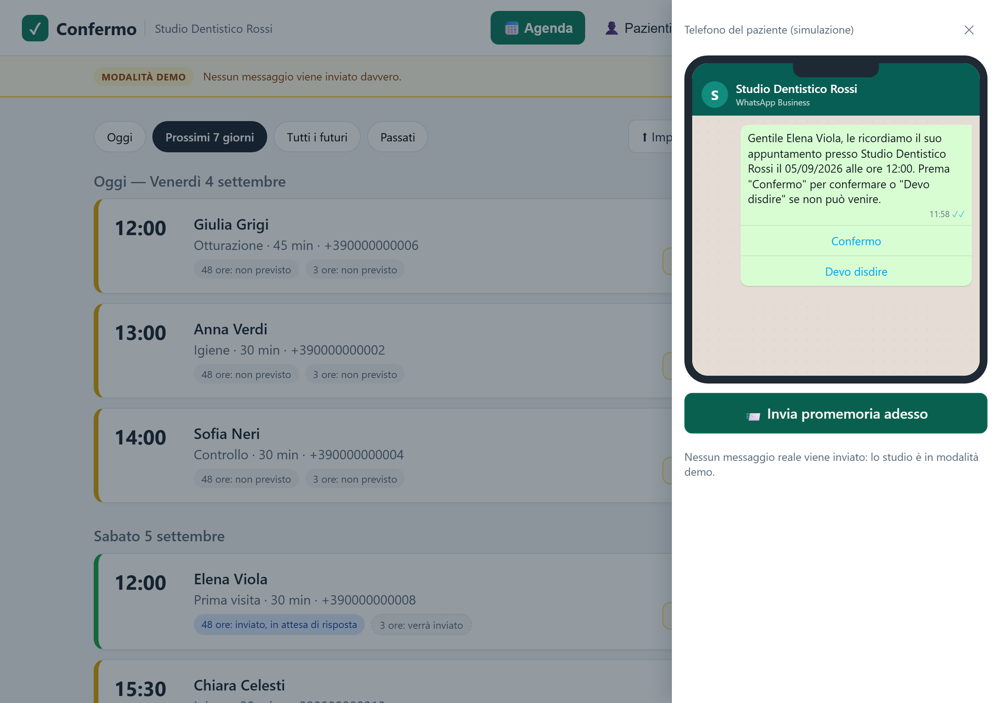
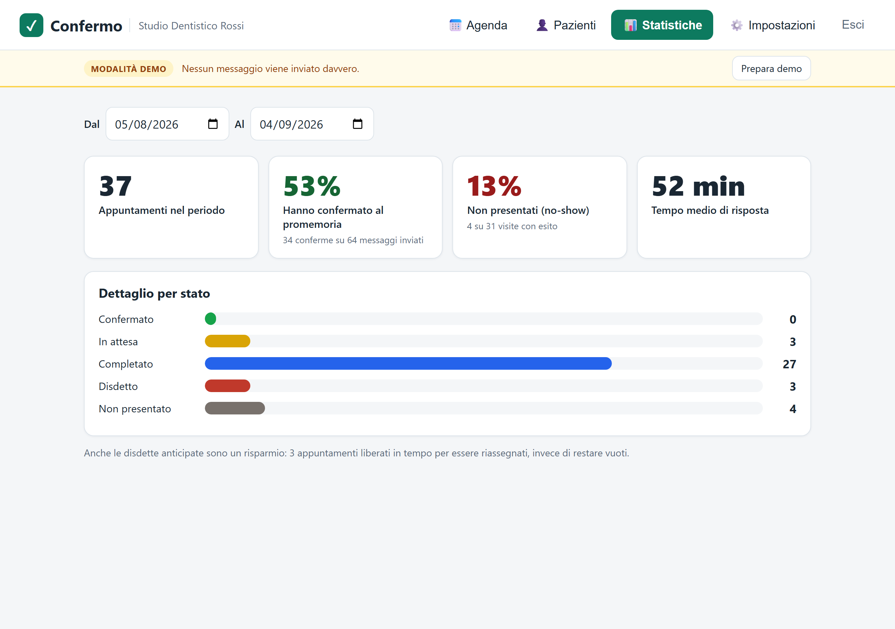

# Confermo

[](https://github.com/zalaso/Confermo/actions/workflows/ci.yml)
[](https://www.typescriptlang.org/)
[](LICENSE)

*[🇬🇧 Read in English](README.en.md)*


**Il problema.** Un appuntamento mancato è tempo che non si recupera, e
ricordarlo per telefono costa alla segreteria un'ora al giorno.
**La soluzione.** Due promemoria automatici su WhatsApp, 48 e 3 ore prima, a cui
il paziente risponde con un tocco: chi disdice libera lo slot in tempo per
riassegnarlo, e la segreteria telefona solo a chi non ha risposto.
**Lo stato.** In produzione su server europei, canale WhatsApp reale collaudato
end-to-end, 157 test automatici. Manca il primo studio pilota — vedi
[cosa manca](#cosa-manca-e-come-andrebbe-fatto).

> ⚖️ **Il codice è pubblico ma non è open source.** È un prodotto commerciale in
> sviluppo: puoi leggerlo, studiarlo e valutarlo liberamente, ma non riutilizzarlo,
> copiarlo o distribuirlo senza autorizzazione scritta. Il repository è aperto per
> mostrare come è fatto, non per essere ripreso — vedi [LICENSE](LICENSE).

---

## Screenshots

**L'agenda della segreteria.** Ogni appuntamento con il suo stato a colori e le
azioni disponibili; in alto i messaggi dei pazienti che richiedono una persona.



**Il telefono del paziente, simulato.** Durante una presentazione mostra il
messaggio come arriverebbe davvero, con i pulsanti cliccabili: premere «Confermo»
qui fa diventare verde la card nell'agenda dietro.



**Le statistiche.** Tasso di conferma, no-show e tempo medio di risposta: i
numeri con cui misurare il servizio, calcolati dal sistema.



> Le immagini si rigenerano con `npm run screenshots`: lo script avvia
> l'applicazione con dati dimostrativi e le cattura con Playwright, così non
> invecchiano rispetto all'interfaccia.

---

## Indice

- [Come funziona](#come-funziona)
- [Funzionalità](#funzionalità)
- [Provarlo in cinque minuti](#provarlo-in-cinque-minuti)
- [Stack tecnologico](#stack-tecnologico)
- [Architettura](#architettura)
- [Privacy e GDPR](#privacy-e-gdpr)
- [Cosa deve fare un cliente per usarlo](#cosa-deve-fare-un-cliente-per-usarlo)
- [Progressi finora](#progressi-finora)
- [Cosa manca e come andrebbe fatto](#cosa-manca-e-come-andrebbe-fatto)
- [Documentazione](#documentazione)

---

## Come funziona

```
  Lo studio inserisce           Confermo programma            Il paziente
  l'appuntamento          →     due promemoria          →     riceve e risponde
  (a mano o da CSV)             (48 ore e 3 ore prima)        con un pulsante
                                                                     │
                                                                     ▼
  La segretaria vede            L'agenda si aggiorna          «Confermo» → confermato
  solo i casi che         ←     da sola                 ←     «Devo disdire» → slot libero
  richiedono una persona                                      testo libero → alla segreteria
```

I promemoria partono dal **numero WhatsApp dello studio**, non da un numero
della piattaforma: è lo studio che scrive ai propri pazienti, ed è anche ciò che
dà al paziente la garanzia di un mittente riconoscibile.

Il comportamento dettagliato — comprese le sei situazioni in cui il sistema
decide di **non** inviare — è in [docs/funzionamento.md](docs/funzionamento.md).

---

## Funzionalità

### Per la segreteria

- **Agenda** per giorno, con stati a colori: in attesa, confermato, disdetto,
  completato, non presentato
- **Inserimento** manuale degli appuntamenti o **import da CSV** (riconosce i
  pazienti già presenti dal numero di telefono)
- **Spostamento** di un appuntamento senza doverlo disdire e ricreare
- **Riquadro «messaggi da gestire»**: disdette e messaggi di testo libero dei
  pazienti, che richiedono una persona
- **Anagrafica pazienti** con consenso privacy, stato di opt-out e cancellazione
  completa dei dati
- **Statistiche**: tasso di conferma, tasso di no-show, tempo medio di risposta,
  appuntamenti liberati in anticipo

### Regole di invio

Il sistema non invia mai alla cieca. Un promemoria **non parte** se il paziente
non ha dato il consenso, se ha chiesto di non essere contattato, se
l'appuntamento è stato disdetto, se il canale non è configurato, o se il
messaggio arriverebbe ormai troppo tardi per essere utile. Dentro la **fascia di
silenzio** (predefinita 21:00–08:00) non viene perso ma rinviato alla prima ora
utile.

Un promemoria **non parte mai due volte** per lo stesso appuntamento: è una
garanzia strutturale, non un accorgimento.

### Risposte dei pazienti

- **Pulsanti** con l'identificativo dell'appuntamento incorporato, così la
  risposta viene agganciata all'appuntamento esatto anche se il paziente ne ha
  più d'uno
- **Ringraziamento** dopo la conferma, come messaggio di sessione dentro la
  finestra di 24 ore di WhatsApp
- **Opt-out automatico** su STOP / BASTA / CANCELLAMI, con riattivazione
  possibile solo a fronte di un nuovo consenso
- **Testo libero non interpretato**: viene mostrato alla segretaria, perché
  indovinare male l'intenzione di un paziente costa più che far leggere una riga

### Modalità dimostrativa

Uno studio può essere marcato come dimostrativo: usa **sempre** un canale
simulato, anche con credenziali reali salvate. Nella dashboard compare un
**telefono simulato** che mostra il messaggio come apparirebbe al paziente, con
i pulsanti cliccabili — il testo non è finto, è quello che il sistema ha
realmente prodotto. Una barra permette di cambiare nome dello studio, tipo di
attività e **azzerare i dati in meno di un secondo**, per passare da una
presentazione all'altra.

I dati dimostrativi comprendono due settimane di storico con esiti realistici e
**identici a ogni esecuzione**, così le statistiche mostrano numeri credibili.

---

## Provarlo in cinque minuti

Serve **Node.js 22+**. PostgreSQL non va installato: viene scaricato come
dipendenza del progetto.

```bash
npm install
npm run db:start                 # database locale (lascia aperto questo terminale)
npm run db:migrate -w apps/api   # solo la prima volta
npm run seed -- --clinic "Studio Demo" --preset dentista
npm run dev:api                  # secondo terminale  → http://localhost:3001
npm run dev:web                  # terzo terminale    → http://localhost:5173
```

Il comando `seed` stampa le credenziali di accesso. Nessuna credenziale WhatsApp
è necessaria: in modalità dimostrativa i messaggi si vedono nel telefono
simulato.

Preset disponibili: `dentista`, `poliambulatorio`, `fisioterapia` — cambiano solo
i dati di esempio, non il funzionamento.

### Comandi utili

```bash
npm test                    # 157 test (avvia un PostgreSQL dedicato, porta 5434)
npm run typecheck           # controllo dei tipi su backend e dashboard
npm run build:web           # build di produzione

npm run backup -w apps/api -- --export --clinic "Studio X" --out b.json
npm run backup -w apps/api -- --import --in b.json
npm run set-password -w apps/api -- --email studio@esempio.it
```

---

## Stack tecnologico

Tutto **TypeScript**, dal database all'interfaccia, con i tipi condivisi fra
backend e frontend in un pacchetto comune: gli stati di un appuntamento e le
transizioni ammesse sono definiti una volta sola e usati da entrambi.

### Backend — `apps/api`

| Tecnologia | Versione | Ruolo |
| --- | --- | --- |
| **Node.js** | ≥ 22 | Ambiente di esecuzione |
| **TypeScript** | 5.8 | Linguaggio, in modalità `strict` |
| **Fastify** | 5.4 | Server HTTP |
| **Prisma** | 6.12 | ORM e migrazioni del database |
| **PostgreSQL** | 17 | Database |
| **TypeBox** | 0.34 | Validazione degli input, con tipi derivati dagli schemi |
| **Luxon** | 3.6 | Fusi orari e ora legale (`Europe/Rome`) |
| **bcryptjs** | 3.0 | Hash delle password |
| **csv-parse** | 5.6 | Import degli appuntamenti da file |
| **tsx** | 4.20 | Esecuzione diretta di TypeScript, senza passo di compilazione |

Plugin Fastify: `@fastify/jwt` e `@fastify/cookie` per le sessioni,
`@fastify/rate-limit` contro i tentativi a raffica sul login,
`@fastify/cors`, `@fastify/static` per servire la dashboard compilata.

### Frontend — `apps/web`

| Tecnologia | Versione | Ruolo |
| --- | --- | --- |
| **React** | 19.1 | Interfaccia |
| **Vite** | 7.0 | Build e sviluppo con ricarica immediata |
| **CSS puro** | — | Nessun framework di stile |

Niente libreria di componenti e nessun gestore di stato esterno: l'interfaccia
ha quattro pagine e uno stato semplice, e le dipendenze in meno sono
manutenzione in meno. Il caricamento dei dati usa un polling leggero (15
secondi) invece di WebSocket — per un'agenda di studio è più che sufficiente e
non introduce una connessione persistente da gestire.

### Test e strumenti

| Tecnologia | Ruolo |
| --- | --- |
| **Vitest** 3.2 | Framework di test |
| **embedded-postgres** | PostgreSQL scaricato come dipendenza: i test di integrazione girano su un database vero, senza Docker né installazioni |
| **npm workspaces** | Monorepo, senza strumenti aggiuntivi |
| **Railway** | Hosting in regione UE |

La scelta di `embedded-postgres` merita una nota: i test di integrazione
avviano un PostgreSQL reale sulla porta 5434, applicano le migrazioni e girano
contro quello. Nessun mock del database — le cose che contano in questo sistema
(blocchi transazionali, vincoli di unicità, comportamento dei fusi orari) sono
esattamente quelle che un mock non riprodurrebbe.

### Dimensioni

| Area | Righe | File |
| --- | --- | --- |
| Backend | 3.900 | 38 |
| Dashboard | 2.000 | 13 |
| Tipi condivisi | 225 | 1 |
| **Test** | **2.700** | **23** |
| Script operativi | 280 | 4 |

Il rapporto fra codice di produzione e test è circa 2:1, concentrato dove un
errore costa: invii duplicati, transizioni di stato, consenso, cifratura.

---

## Architettura

```
apps/api          Backend, API REST + scheduler
apps/web          Dashboard React, in italiano
packages/shared   Tipi e regole condivise (stati, transizioni, modelli)
docs/             Documentazione
```

**Un solo processo** serve API, dashboard e scheduler: nessuna coda esterna,
nessun Redis, nessun servizio di background separato. Gira su un piccolo server
o su una piattaforma gestita, e in produzione l'API serve anche la dashboard
compilata — un solo dominio, nessun CORS da configurare.

### Il modello dati

Sei tabelle, tutte collegate a `clinic` (lo studio):

```
clinic ──┬── user              accesso allo studio
         ├── patient           anagrafica, consenso, opt-out
         ├── appointment ──── reminder      promemoria programmati
         ├── message_template testi dei messaggi
         ├── inbound_message  messaggi ricevuti (con deduplicazione)
         └── event_log        registro, senza dati personali nel contenuto
```

Cinque migrazioni Prisma, tutte additive.

### Le tre scelte che contano

**Lo scheduler senza coda esterna.** I promemoria vengono materializzati come
righe sul database appena l'appuntamento viene creato, con l'orario di invio già
calcolato. Un processo interno le reclama ogni 60 secondi con `FOR UPDATE SKIP
LOCKED` e le marca come inviate **prima** della chiamata al provider. Ne segue
che un promemoria non può partire due volte nemmeno con più processi attivi o
dopo un riavvio: nel caso peggiore risulta inviato senza esserlo, mai il
contrario.

**Il canale WhatsApp come astrazione, configurato per singolo studio.** Il resto
del sistema non sa quale provider è attivo. Esistono tre implementazioni: un
canale simulato per demo e sviluppo, **360dialog** (intermediario ufficiale) e la
**Cloud API di Meta** diretta. Poiché 360dialog è un proxy sopra la stessa API di
Meta, la logica comune vive in un solo posto. Le credenziali sono cifrate
AES-256-GCM con il codice dello studio come dato associato: una credenziale
copiata sulla riga di un altro studio non è decifrabile.

**Multi-studio dallo schema.** Ogni entità è collegata a uno studio fin
dall'inizio, pur restando oggi un accesso unico per studio.

### Verifica

**157 test automatici** (Vitest), di cui la maggior parte di integrazione su un
PostgreSQL reale avviato dalla suite. Coprono le parti dove un errore costa:
unicità degli invii con scheduler concorrenti, webhook consegnati due volte,
transizioni di stato, consenso e opt-out, cifratura delle credenziali, fascia di
silenzio, promemoria in ritardo, resilienza alla caduta del database, e il ciclo
completo di backup e ripristino.

### Monitoraggio

`GET /api/health` risponde **503** in tre casi: database irraggiungibile,
scheduler fermo da oltre cinque minuti, o **invii che falliscono in blocco**.
Quest'ultimo è il guasto silenzioso — se le credenziali di uno studio scadono lo
scheduler continua a girare e ogni altro controllo resta verde, mentre nessun
paziente riceve più niente.

---

## Privacy e GDPR

Sono vincoli di progetto, non note a margine:

- **Nessun dato sanitario.** Solo nome, telefono, data/ora e una dicitura
  generica della tipologia, limitata a 40 caratteri con un avviso esplicito
  nell'interfaccia.
- **La tipologia non entra nei messaggi**, ed è deliberato: comparirebbe
  nell'anteprima della notifica sul telefono, leggibile da chiunque abbia il
  dispositivo in mano.
- **Consenso come condizione tecnica**: senza consenso registrato il sistema non
  invia. Non è una spunta formale, è una verifica a ogni invio.
- **Diritto all'oblio**: cancellazione completa di un paziente; restano solo le
  statistiche aggregate, che non contengono dati personali.
- **Dati in Unione Europea**, applicazione e database.
- **Credenziali cifrate** e mai restituite in chiaro dalle API.

---

## Cosa deve fare un cliente per usarlo

Lo studio non installa nulla: accede da browser. Ma il canale WhatsApp è
**intestato allo studio**, quindi serve materiale suo. Documento completo da
consegnare: [docs/per-lo-studio.md](docs/per-lo-studio.md).

### Cosa deve procurarsi

| Serve | Perché | Attenzione |
| --- | --- | --- |
| **Un numero di telefono dedicato** | È il mittente che i pazienti vedono | Non deve essere già usato su WhatsApp; se lo è, la rimozione richiede giorni |
| **Un documento dello studio** | WhatsApp verifica che esista | Visura camerale, certificato P. IVA, atto costitutivo o estratto conto |
| **Partita IVA e denominazione legale** | Devono coincidere alla lettera col documento | |
| **Un sito web pubblico in https** | Richiesto da WhatsApp per la verifica | Causa più frequente di rallentamento se manca |
| **Un indirizzo email accessibile** | Registrazione e comunicazioni | |

### Il consenso dei pazienti

Va raccolto **una volta sola** per paziente e inserito nella modulistica di prima
accoglienza. Bozza in [docs/modelli/consenso-pazienti.md](docs/modelli/consenso-pazienti.md),
**da far validare a un professionista**. Senza consenso registrato il sistema non
invia nulla a quel paziente.

### La domanda che decide tutto

**Che gestionale usa lo studio, e sa esportare gli appuntamenti?**

Se l'esportazione è possibile, la segretaria carica un file CSV una volta al
mattino. Se non lo è, gli appuntamenti vanno inseriti due volte — nel gestionale
e qui. È fattibile, ma è il motivo principale per cui questi sistemi vengono
abbandonati dopo tre settimane. Va chiarito **prima** di attivare.

### Tempi

Circa **un'ora** insieme allo studio, più l'approvazione di WhatsApp: da poche
ore a un paio di giorni lavorativi, e può essere rifiutata al primo tentativo.
Procedura operativa: [docs/riferimenti/checklist-attivazione.md](docs/riferimenti/checklist-attivazione.md).

---

## Progressi finora

| Fase | Risultato |
| --- | --- |
| **MVP** (lug 2026) | Modello dati, CRUD, import CSV, scheduler idempotente, dashboard in italiano, metriche, 35 test |
| **Canale per studio** | Astrazione provider, 360dialog, credenziali cifrate, webhook con deduplicazione, opt-out, finestra 24 ore |
| **Demo-ready** | Modalità dimostrativa per studio, telefono simulato interattivo, seed parametrico con preset di settore |
| **Hardening** | Rate limiting, cambio password, guardia sui promemoria in ritardo, fascia di silenzio |
| **In produzione** | Deploy su Railway in regione EU, HTTPS pubblico, migrazioni automatiche |
| **Provider Meta** | Cloud API diretta accanto a 360dialog, per collaudare sul numero di test gratuito |
| **Collaudo reale** | Catena completa validata contro WhatsApp: invio, conferma, disdetta, ringraziamento, testo libero, opt-out |
| **Operatività** | Health check sul guasto silenzioso, backup esportabili e ripristino verificato, 157 test |

Ciò che il collaudo reale ha fatto emergere — errore `132001`, sottoscrizione al
campo `messages`, iscrizione dell'app all'account WhatsApp — è documentato in
[docs/riferimenti/whatsapp-collaudo-meta.md](docs/riferimenti/whatsapp-collaudo-meta.md),
perché sono trappole che costano un pomeriggio a chi le incontra la prima volta.

---

## Cosa manca e come andrebbe fatto

Elencato in ordine di quanto pesa, con l'approccio suggerito. Ogni voce esiste
anche come **issue pronta da aprire** in [docs/issues/](docs/issues/), con
criteri di accettazione, file coinvolti e insidie note.

### 1. Integrazione con i gestionali di studio

**Il problema.** Senza esportazione automatica dal gestionale, la segretaria
inserisce gli appuntamenti due volte. È l'ostacolo principale all'adozione, più
di qualsiasi funzione mancante.

**Come farlo.** Non esiste uno standard: ogni gestionale ha il suo. L'approccio
sensato è partire dal gestionale del primo studio pilota e costruire un
adattatore dedicato, mantenendo l'import CSV come via universale. Se il
gestionale espone un'API, un job periodico che sincronizza l'agenda; altrimenti,
un watcher su un file esportato automaticamente. Da valutare solo dopo aver
visto **un** caso reale: costruire un'astrazione prima di conoscere due
gestionali diversi è tempo sprecato.

### 2. Utenti multipli e ruoli

**Il problema.** Oggi c'è un accesso unico per studio: il dentista e la
segretaria condividono la stessa password.

**Come farlo.** Lo schema è già pronto (`user` è una tabella separata collegata a
`clinic`). Serve aggiungere un campo ruolo, una pagina di gestione utenti, e
distinguere i permessi — plausibilmente: la segreteria non tocca le impostazioni
del canale, il titolare sì. Mezza giornata.

### 3. Recupero password autonomo

**Il problema.** Se uno studio perde la password serve un intervento manuale sul
server.

**Come farlo.** Richiede un servizio di invio email (Resend o simile), una
tabella di token temporanei con scadenza, e due schermate. Un giorno.
Alternativa più semplice e in linea col prodotto: recupero via **WhatsApp** sul
numero dello studio, riusando il canale già configurato.

### 4. Notifica proattiva allo studio quando qualcosa si rompe

**Il problema.** L'health check avvisa **chi gestisce il servizio**, non lo
studio. Se il canale di uno studio si rompe, la segretaria lo scopre guardando
l'agenda.

**Come farlo.** Un banner in dashboard quando ci sono invii falliti recenti — è
il pezzo più utile e costa poco, i dati ci sono già. L'email di avviso viene
dopo, e dipende dal punto 3.

### 5. Esportazione dati per lo studio (portabilità GDPR)

**Il problema.** Il comando di backup è per chi amministra il servizio. Uno
studio che chiede i propri dati dipende da noi.

**Come farlo.** Un pulsante in Impostazioni che scarica lo stesso export in JSON
o CSV. La logica esiste già in `apps/api/src/demo/backup.ts`: serve solo una
rotta e un pulsante. Poche ore.

### 6. Lista d'attesa

**Il problema.** Quando un paziente disdice, lo slot liberato va riassegnato a
mano.

**Come farlo.** Una lista di pazienti disponibili a farsi chiamare, e alla
disdetta un messaggio al primo della lista con il posto libero. È la funzione con
il valore percepito più alto, ma va costruita **dopo** che un pilota reale ha
dimostrato che le disdette anticipate arrivano davvero — altrimenti si ottimizza
un problema che non si è ancora misurato.

### Fuori ambito per scelta

Fatturazione e pagamenti, receptionist vocale, app mobile dedicata, iscrizione
self-service del canale WhatsApp (richiede lo status di Tech Provider presso
Meta).

### Non è codice, ma blocca l'uso reale

- **Contratto di nomina a responsabile del trattamento** (art. 28 GDPR) firmato
  con lo studio: bozza in [docs/modelli/kit-gdpr.md](docs/modelli/kit-gdpr.md),
  da far verificare a un professionista
- **Modulo di consenso** validato
- **Piano di hosting a pagamento** e monitoraggio esterno configurato: vedi
  [docs/riferimenti/operativita.md](docs/riferimenti/operativita.md)

---

## Documentazione

| Documento | Contenuto |
| --- | --- |
| [docs/funzionamento.md](docs/funzionamento.md) | Come funziona il sistema nel dettaglio: regole di invio, stati, privacy, architettura |
| [docs/setup.md](docs/setup.md) | Installazione e attivazione, passo per passo |
| [docs/per-lo-studio.md](docs/per-lo-studio.md) | Da consegnare al cliente: cosa fa, cosa serve, cosa non inserire |
| [docs/README.md](docs/README.md) | Indice completo, compresi modelli e approfondimenti |

---

## Licenza

Tutti i diritti riservati. Il codice è consultabile a scopo di valutazione; ogni
uso, copia o distribuzione richiede autorizzazione scritta. Vedi
[LICENSE](LICENSE).
